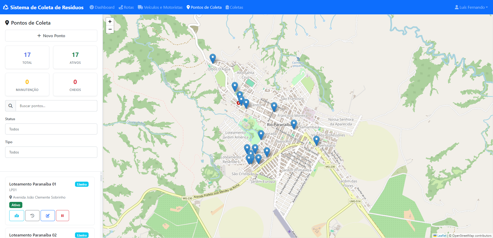
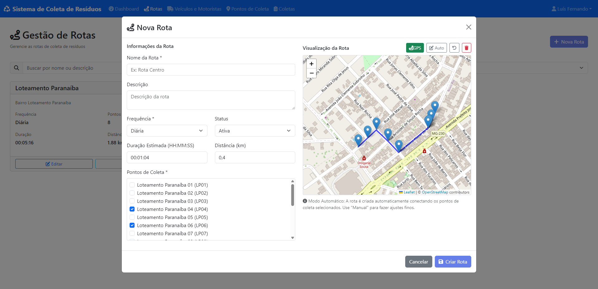
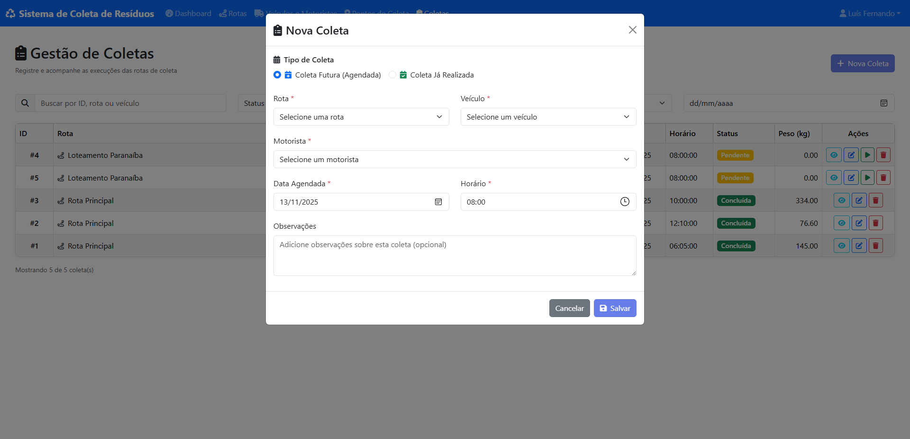
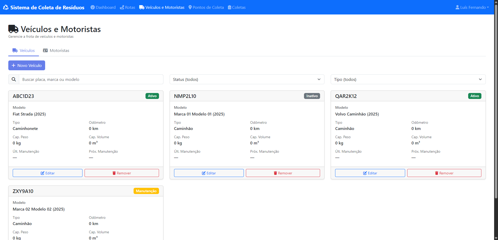
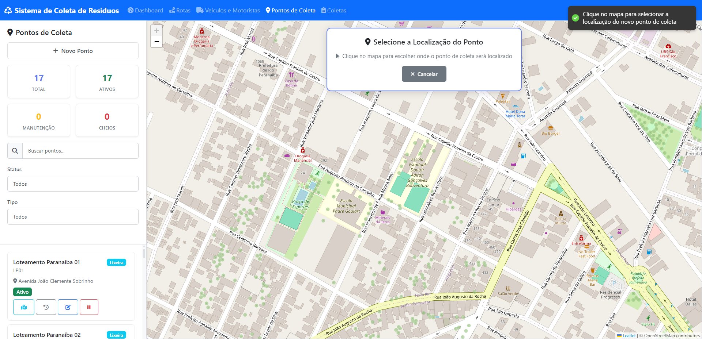
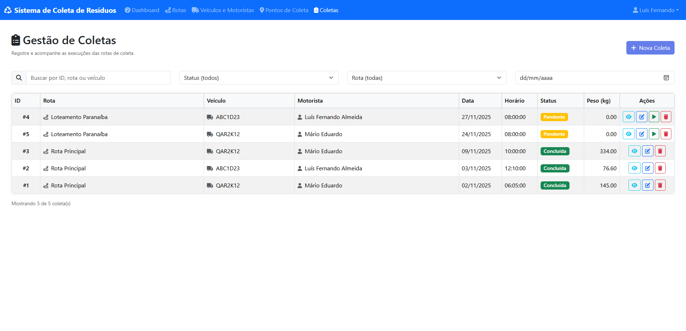

## Sistema Web para Controle da Coleta de Resíduos Sólidos Urbanos

Sistema completo para gestão da coleta de resíduos sólidos urbanos, com backend em **Django + Django REST Framework + PostGIS**, frontend em **React** e infraestrutura **dockerizada** com PostgreSQL/PostGIS, Redis e Celery.

Este sistema foi desenvolvido como parte de um **Trabalho de Conclusão de Curso (TCC)** do curso de **Sistemas de Informação** da **Universidade Federal de Viçosa - Campus Rio Paranaíba (UFV‑CRP)**.





## Tecnologias principais

- **Frontend**: React, React Router, Axios, React-Query, React Bootstrap, Leaflet/React-Leaflet, Chart.js
- **Backend**: Python 3.11, Django, Django REST Framework, GeoDjango, Celery, Redis
- **Banco de dados**: PostgreSQL, PostGIS
- **Infraestrutura**: Docker, Docker Compose

## Pré‑requisitos

- **Docker** e **Docker Compose** instalados

Todo o ambiente (PostgreSQL/PostGIS, Redis, backend e frontend) é iniciado via Docker.

## Como executar o projeto

Na raiz do repositório `sistema-coleta-rsu`:

1. Construir e subir os contêineres:

   ```powershell
   docker compose up --build
   ```

   Após a primeira execução, você pode usar apenas:

   ```powershell
   docker compose up
   ```

2. (Opcional) Criar um superusuário para acesso ao Django Admin e ao sistema:

   ```powershell
   docker compose exec -T backend python manage.py createsuperuser
   ```

## Documentação

Os documentos complementares do projeto estao disponiveis na pasta `docs/`:

- [documentacao_tecnica.pdf](docs/documentacao_tecnica.pdf): documentacao tecnica com arquitetura, componentes e detalhes de implementacao.
- [guia_usuario.pdf](docs/guia_usuario.pdf): guia pratico de uso das funcionalidades do sistema.

## Galeria








